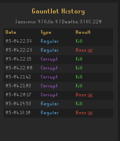

# Gauntlet History

 &nbsp; 

A RuneLite plugin that tracks every Gauntlet and Corrupted Gauntlet run — kills, deaths, prep/fight times, and detailed boss-fight performance — and exports them to a self-contained HTML report.

## Features

- **Session tracking** — automatically records each run from the moment you enter the Gauntlet to when you leave
- **Accurate times** — sourced from the game's own completion messages (`Preparation time: 2:59.4. Hunllef kill time: 3:10.8.`), not wall-clock estimates
- **Performance metrics** — tick efficiency, damage taken/given, wrong offensive/defensive prayers, wrong attack style, tornado hits, stomp hits, and more
- **Persistent history** — sessions survive client restarts; stored in `~/.runelite/gauntlet-history/sessions.json`
- **HTML export** — one-click (or automatic) export to a fully offline, self-contained HTML report with:
  - Regular / Corrupted tab switching
  - Summary stat cards (total runs, kills, deaths, kill rate, highest KC)
  - Collapsible performance charts with 5-run moving-average overlay
  - Sortable run table with pagination (50 runs per page)
  - Hover tooltips on charts

## Plugin panel

The side panel shows your last 50 sessions at a glance:

| Column | Description |
|--------|-------------|
| Date   | `MM-dd HH:mm` of run start |
| Type   | Regular (blue) or Corrupted (purple) |
| Result | Kill (green), Boss Death, Prep Death, or Left (grey) |

The stats bar at the top shows total sessions, kills, deaths, and your highest recorded KC.

## Config options

| Option | Default | Description |
|--------|---------|-------------|
| Auto-export after run | Off | Writes `export.html` automatically after every completed run |
| Max sessions to keep | 500 | Oldest sessions are dropped when the limit is reached (0 = unlimited) |
| Count no-weapon off-prayer | Off | Treats unarmed/sceptre attacks without an offensive prayer as a wrong off-prayer tick |

## HTML export

Click **Export to HTML** in the plugin panel. The file is written to:

```
~/.runelite/gauntlet-history/export.html
```

and opens in your default browser immediately. The report is fully self-contained — no internet connection required.

### Charts

Six charts are shown per variant, plotting the last 50 runs chronologically:

- Tick Efficiency (%)
- Fight Time
- Damage Taken
- Wrong Offensive Prayers
- Wrong Defensive Prayers
- Wrong Attack Style

The faint line is the raw per-run value; the bold line is a 5-run moving average. Click **Hide Avg / Show Avg** to toggle it across all charts at once.

### Table

All columns are sortable — click a header once for ascending, again for descending. Runs without a value (e.g. no KC recorded yet) sort to the bottom regardless of direction.

## Data storage

| File | Description |
|------|-------------|
| `~/.runelite/gauntlet-history/sessions.json` | Full session history |
| `~/.runelite/gauntlet-history/export.html`   | Last HTML export |

See [SESSION_FORMAT.md](SESSION_FORMAT.md) for a full description of the JSON schema.

## Building

```bash
./gradlew build   # compile + test
./gradlew run     # launch RuneLite dev client with the plugin loaded
```

Requires Java 11+. Set `JAVA_HOME` if Gradle cannot find your JDK.

## Acknowledgements

- [**gauntlet-loot-popup**](https://github.com/ldavid432/gauntlet-loot-popup) by ldavid432 — referenced for RuneLite loot event handling patterns (`LootReceived`, `ServerNpcLoot`)
- [**runelite-plugins**](https://github.com/Adam-/runelite-plugins) by Adam — referenced for loot tracker integration patterns

## License

BSD 2-Clause — see [LICENSE](LICENSE).
